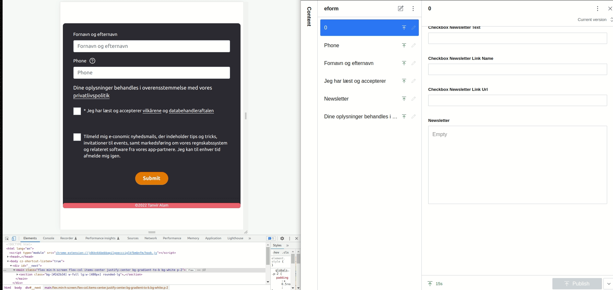
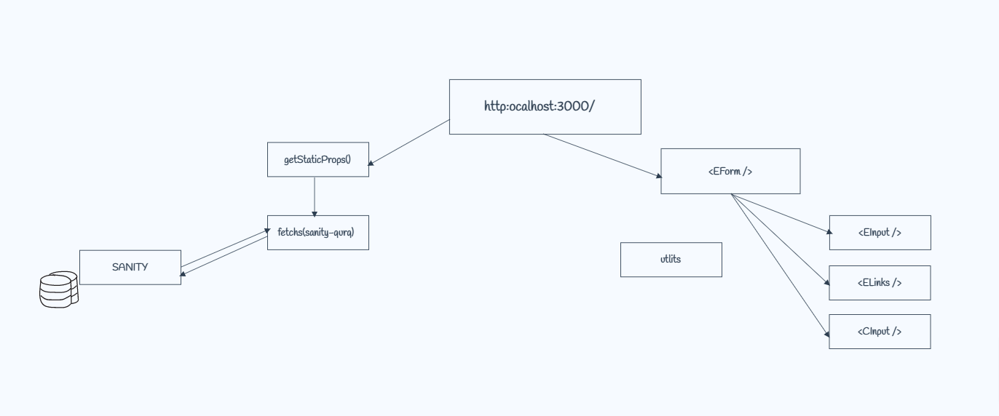

# Create T3 App

This is a [T3 Stack](https://create.t3.gg/) project bootstrapped with `create-t3-app`.

## What's next? How do I make an app with this?

We try to keep this project as simple as possible, so you can start with just the scaffolding we set up for you, and add additional things later when they become necessary.

If you are not familiar with the different technologies used in this project, please refer to the respective docs. If you still are in the wind, please join our [Discord](https://t3.gg/discord) and ask for help.

- [Next.js](https://nextjs.org)
- [NextAuth.js](https://next-auth.js.org)
- [Prisma](https://prisma.io)
- [Tailwind CSS](https://tailwindcss.com)
- [tRPC](https://trpc.io)

## Learn More

To learn more about the [T3 Stack](https://create.t3.gg/), take a look at the following resources:

- [Documentation](https://create.t3.gg/)
- [Learn the T3 Stack](https://create.t3.gg/en/faq#what-learning-resources-are-currently-available) — Check out these awesome tutorials

You can check out the [create-t3-app GitHub repository](https://github.com/t3-oss/create-t3-app) — your feedback and contributions are welcome!

## How do I deploy this?

Follow our deployment guides for [Vercel](https://create.t3.gg/en/deployment/vercel) and [Docker](https://create.t3.gg/en/deployment/docker) for more information.

## Task at hand: Deploy

### Build UI for an e-conomic trial form similar to the one we use on the e-conomic website.

-[x] The form must look good on mobile, as well as both big and small desktop screens.

-[x] You are expected to use HTML, CSS and JS to solve the task.

-[x] You are expected to use similar colors, like black/blue background, white text, checkbox with orange background - however, it doesn’t have to be completely similar to the example on the right

-[x] On desktop, the form should have a width of 480px (and be horizontally centered). On mobile, the form should fill out 90% of the screen (and also be horizontally centered). You decide yourself what size to use for mobile

-[x] Please make form components configurable. Meaning that an employee (CMS Editor) with some minimal training should be able to change fields validation rules, add/remove fields to form, and change field labels.

-[x] 3 fields are required in the form (marked by asterixes). The message about missing data should be displayed below the field (see example to the right). Validation should happen when the user submits a
form. Phone field has a popup functionality.

-[x] You are free to use any libs you need, like jQuery or just clean JavaScript. You decide.

## Animation:
  

  

## Flow Chart

